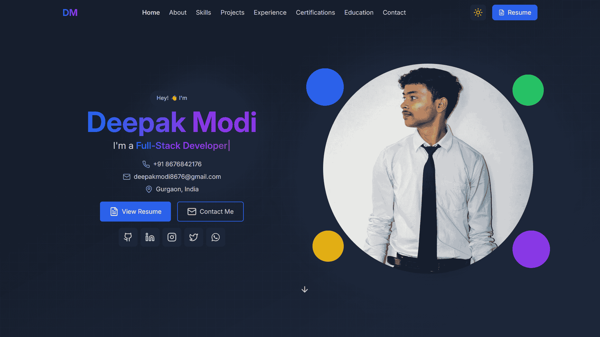

# Aman - Portfolio Website for a Full Stack Developer

Welcome to **My Portfolio**! This is my personal portfolio for showcasing my skills, projects, experience, education, certifications, and more. It's built using React, TypeScript, Tailwind CSS, and other modern web technologies. It fetches data from various APIs to display the latest information, such as GitHub repositories and LeetCode submissions. The portfolio is responsive, interactive, and optimized for performance.

Check it out live at: [https://aman-portfolio.vercel.app/](https://aman-portfolio.vercel.app/)

---

## 🚀 Features

- **Responsive Design**: The portfolio adjusts to all screen sizes, ensuring an optimal experience on both desktop and mobile devices.
- **Smooth Animations**: Interactive elements, hover effects, and smooth scrolling give the user a pleasant experience.
- **Dynamic Content**: Fetches data from various APIs to display the latest information, such as GitHub repositories and LeetCode submissions.
- **Interactive Icons**: Utilizes Lucide icons for a modern and interactive design.
- **SVG Signature Animation**: Framer-Motion is used to animate the SVG signature on the loading page.
- **Dark Mode**: Built with dark mode support using a simple toggle to switch between light and dark themes.
- **Custom Sections**:
  - **Home**: Introduction, Typewriter effect with dynamic roles, and links to key sections.
  - **About**: A section that provides more insight into my background and skills.
  - **Skills**: Displays my technical skills, organized by categories.
  - **Projects**: Showcase of personal and professional projects.
  - **GitHub**: Fetches and displays my GitHub repositories with a link to view the profile.
  - **LeetCode**: Fetches and displays my LeetCode submissions.
  - **Experience**: Details about my work experience with a timeline layout.
  - **Education**: My academic journey including degree and institution.
  - **Certifications**: Certificates and courses completed with a link to verify.
  - **Contact**: A form to reach out to me directly.
- **SEO Optimized**: Ensures visibility on search engines.
- **Performance Optimized**: Optimized for fast loading with minimal web vitals.

---

## 📂 **Directory Structure**

```
└── aman portfolio/
    ├── README.MD
    ├── LICENSE
    ├── eslint.config.js
    ├── index.html
    ├── package.json
    ├── postcss.config.js
    ├── tailwind.config.js
    ├── tsconfig.app.json
    ├── tsconfig.json
    ├── tsconfig.node.json
    ├── vite.config.ts
    ├── public/
    │   └── assets/
    └── src/
        ├── App.tsx
        ├── index.css
        ├── main.tsx
        ├── vite-env.d.ts
        ├── components/
        │   ├── About.tsx
        │   ├── Certifications.tsx
        │   ├── Contact.tsx
        │   ├── Education.tsx
        │   ├── Experience.tsx
        │   ├── Footer.tsx
        │   ├── GitHub.tsx
        │   ├── Hero.tsx
        │   ├── Leetcode.tsx
        │   ├── Link.tsx
        │   ├── Navbar.tsx
        │   ├── Projects.tsx
        │   ├── Skills.tsx
        │   ├── hero/
        │   │   ├── ActionButtons.tsx
        │   │   ├── ContactInfo.tsx
        │   │   └── SocialLinks.tsx
        │   ├── loading/
        │   │   ├── HandwritingAnimation.tsx
        │   │   ├── LoadingScreen.tsx
        │   │   └── svgPaths.ts
        │   └── ui/
        │       ├── AboutCard.tsx
        │       ├── CertificationCard.tsx
        │       ├── ContactForm.tsx
        │       ├── CustomCursor.tsx
        │       ├── EducationCard.tsx
        │       ├── ProjectCard.tsx
        │       ├── SectionTitle.tsx
        │       ├── ThemeToggle.tsx
        │       ├── Timeline.tsx
        │       └── TypeWriter.tsx
        └── hooks/
            ├── useAnimatedLogo.ts
            ├── useLoading.ts
            └── useTheme.ts
```

---

## 🛠 Technologies Used

- **React**: JavaScript library for building the user interface.
- **TypeScript**: A superset of JavaScript that adds type safety and improves code quality.
- **Tailwind CSS**: A utility-first CSS framework to rapidly build custom designs.
- **Lucide Icons**: Used for interactive and sleek icons.
- **Vercel**: For fast deployment and hosting.
- **GitHub API**: To fetch and display repositories.
- **Framer-Motion**: For svg signature loading animation.

---

## 📸 Screenshots

Here's a glimpse of the portfolio:



---

## 📜 License

This project is licensed under the MIT License - see the `LICENSE` file for details.

---

## 📬 Contact

Feel free to reach out to me through any of the following channels:

- **Email**: [aman.it360@gmail.com](mailto:aman.it360@gmail.com)
- **LinkedIn**: [linkedin.com/in/aman](https://linkedin.com/in/aman)
- **Website**: [aman-portfolio.vercel.app](https://aman-portfolio.vercel.app)

---

### 🔥 Made with ❤️ by **Aman Kumar**

